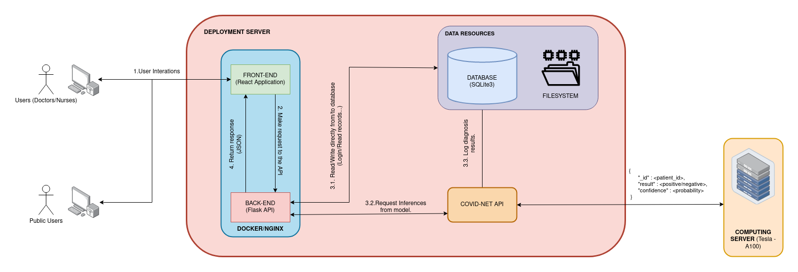

# COVID-Net-demo

# Introduction
This repository is a web demo for the COVID-Net model for COVID-19 image classification for 
diagnosis.

# System Diagram


# Set up

## 1. Install all requirements
```
pip3 install -r requirements.txt
```

## 2. Set up SQLite database 
```bash
$ sqlite3 fyp.db < init.sql 
```

## 3. Heroku deployment
```bash
$ heroku git:remote -a <heroku_app_name>  # Set remote git repo to heroku app repo
$ git add . 
$ git commit -am "Commit changes"
$ git push heroku main 
```

## 4. Setting up deployment server
- 1. Go to https://github.com/hieubkvn123/COVID-Net.
- 2. Clone the repository to a public computing server.
- 3. Go to https://github.com/lindawangg/COVID-Net/blob/master/docs/models.md and download the COVIDNet-CXR-2 model and put it
into the models folder of the COVID-Net repository cloned in step 1.
- 4. Run the ``serve_model.sh`` script to deploy the covidnet model.
- 5. (**NOTE**) If the port 8889 is not public in the computing server. Enable port 8889 using firewall-cmd:
```bash
 firewall-cmd --permanent --zone=public --add-port=8889/tcp
 firewall-cmd --reload
```

# TODO
- [x] Login functionalities.
	- [x] Create the templates and the login form.
	- [x] Create the functionalities to retrieve data from users and compare against databse.
	- [x] Add JWT token based authentication for login function.
	
- [x] Create records and diagnosis.
	- [x] Create the Create Record form.
	- [x] Create the functionalities to retrieve record data and store in database.
	- [x] Create a function to redirect X-Ray image to computing server and retrieve result.
	- [ ] Create a function to view all records in tables.

# REFERENCES
- COVID-Net: A Tailored Deep Convolutional Neural Network Design for Detection of COVID-19 Cases from Chest X-Ray Images : [Paper](https://arxiv.org/abs/2003.09871)
- COVID-Net implementation : [Github](https://github.com/hieubkvn123/COVIDNet-Implementation)
